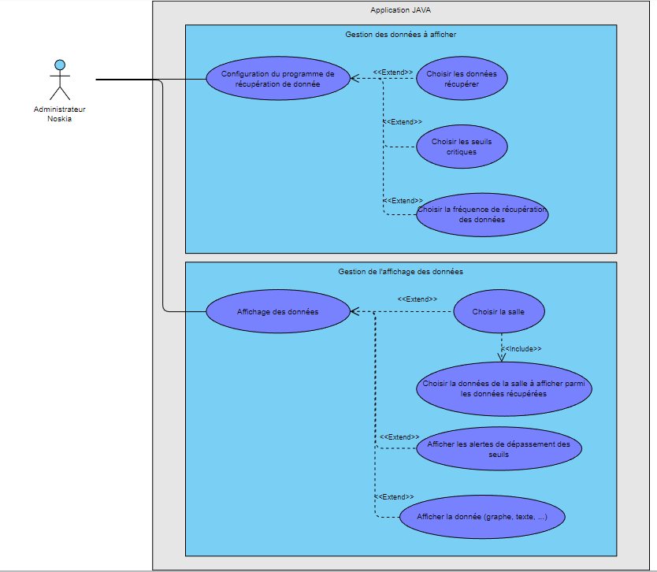

= Documentation Technique Java
:icons: font
:models: models
:experimental:
:incremental:
:numbered:
:toc: macro
:window: _blank
:correction!:

toc::[]

== Présentation de l'application

== Use case Global
``Use case :``

Voici l'use case global de l'application java : 

Cette application ne contient aucun système de compte. L'application ne sera utilisé que par les admnistrateur et employé Noskia.

``Spécificités :``

Les administrateurs Noskia pourront avoir accès à deux fonctionnalités : la configuration du programme qui se charge de récupérer les données émises par les capteurs et l'affichage de ces données ::
*Configuration de l'application de récupération de données :* L'administrateur pourra choisir quel type de données il veut récupérer, à quelle fréquence et à quel seuil ces derniers lancerons une alerte. +
*Affichage des données:*  Les données seront affichées par salle. L'affichage des données se fera via un diagramme en bâton. De plus, une partie de la page d'affichage des données sera réservée

== Architecture

== Installation

=== Pour le développement

=== Pour l'utilisateur

== Explication des fonctionalités

