= Documentation Technique Java
:icons: font
:models: models
:experimental:
:incremental:
:numbered:
:toc: macro
:window: _blank
:correction!:

toc::[]

== Présentation de l'application

L'application Java servira d'interface avec l'utilisateur (dans notre cas, les administrateurs Noskia) pour paramétrer le fichier de configuration qui sera lu par le programme Python. L'utilisateur pourra paramétrer les types de données récupérées par les capteurs, la fréquence des données du capteur, la valeur des seuils d'alertes par type de donnée. + 

L'application Java permettra aussi d'afficher en temps réel les valeurs des dernières données reçues.

== Use case Global
``Use case :``

Voici l'use case global de l'application java : 

image::./images/useCaseGlobal.png[Images use case global]

Cette application ne contient aucun système de compte. L'application ne sera utilisé que par les admnistrateur et employé Noskia.

``Spécificités :``

Les administrateurs Noskia pourront avoir accès à deux fonctionnalités : la configuration du programme qui se charge de récupérer les données émises par les capteurs et l'affichage de ces données ::
*Configuration de l'application de récupération de données :* L'administrateur pourra choisir quel type de données il veut récupérer, à quelle fréquence et à quel seuil ces derniers lancerons une alerte. +
*Affichage des données:*  Les données seront affichées par salle. L'affichage des données se fera via un diagramme en bâton. De plus, une partie de la page d'affichage des données sera réservée

== Architecture

=== Architecture générale des sous-systèmes

``Sous-système python :`` + 
Le sous-sytème de l'application python est composé de 4 fichiers. Le fichier config.ini, le fichier app.py, le fichier data.json et le fichier alarmes.txt. Voici comment ces différent fichier intéragisse entre eux :

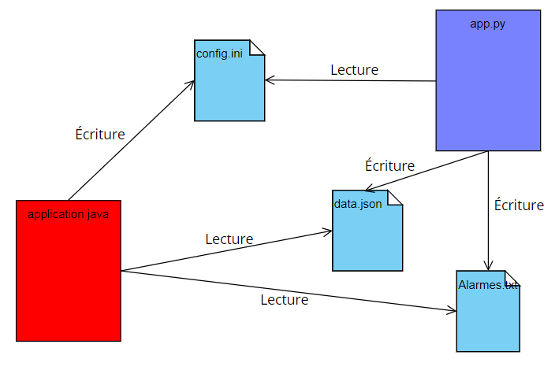

Le rôle du fichier _config.ini_ est d'enregistrer la configuration du programme python, cette dernière sera réalisé via l'application Java. Une page sera dédié à la configuration des types de données récupérées par les capteurs, de la fréquence des données du capteur, de la valeur des seuils d'alertes par type de donnée. Le programme Java va donc écrire dans fichier le paramétrage rentré par l'utilisateurs.

Les fichiers _data.json_ et _alarmes.txt_ vont être lu par le programme Java pour pouvoir afficher leur contenu graphiquement. Leurs rôles est de stocker les informations envoyé par l'application python.

``Sous-système des pages :`` +
Le sous-sytèmes des pages correspond à la partie View (V) du MVC(Model, View, Controller). Voici comment ce sous-sytème fonctionne : 

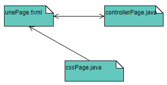

Voici comment fonctionne l'affichage de chaque page. Pour chaque page, un fichier _.fxml_ lui est attribué. Ce dernier contiendra tout les éléments qui sont affiché sur la page. +
Ensuite, à cette page sera reliée un fichier _.css_ qui permettra de styliser certain de la page pour améliorer le design de cette dernière. + 
Et pour finir, chaque page aura un contrôler de vue. Ce dernier permettra de gérer l'affichage de la page. Par exemple, le contrôler de vue pourra afficher dynamiquement les éléments de la page, associer l'intéraction d'un élément de la page avec un évènement ou encore actualiser l'affichage de certaine partie de la page.

=== Ressources externes utilisées

``Intéraction avec un fichier .ini : ``

Nous avons utilisé l'API ini4j pour pouvoir communiquer avec un fichier .ini depuis un programme python 

Lien : :: 
* Vers la documentation , cliquez https://jar-download.com/artifacts/org.ini4j/ini4j/0.5.4/documentation[ici] +
* Pour pouvoir télécharger le fichier jar, cliquez https://talend-update.talend.com/nexus/content/repositories/libraries/org/ini4j/ini4j/0.5.1/ini4j-0.5.1.jar[ici] +

``Intéraction avec un fichier .json : ``
Pour intéragir avec le fichier json, nous avons utilisé l'API externe javafx.json

Lien : :: 
* Vers la documentation , cliquez https://docs.oracle.com/javaee/7/api/javax/json/package-summary.html[ici] +
* Pour pouvoir télécharger le fichier jar, cliquez https://drive.google.com/uc?export=download&id=1c8e1rYjwNv-Eu91acEgwKRVxn9r_QaMO[ici] +

=== Structuration en package de l'application 

Nous avons donc choisi de structurer notre application en 3 partie afin de réaliser un MVC 

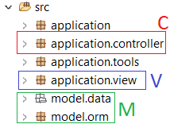

``PARTIE Controller (en rouge) : `` :: 
Cette partie du projet contiendra tous les fichiers de gestion de dialogue entre la partie Model et la partie View. Ces contrôleurs serviront principalement à faire dialoguer les différentes parties du projet entre elles. +
Par exemple, si la page qui affiche les données (se situant dans la partie View) veut interagir avec le programme Python (pour par exemple récupérer de nouvelles données), elle devra faire appel à son contrôler de gestion de dialogues attitrés dans le package Controller. + 
Voici les fichiers que contient ce package : 

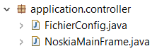

Description des classes : ::
*FichierConfig.java :* le contrôleur de dialogues de la page de paramétrage du fichier de configuration. +
*NoskiaMainFrame.java :* le contrôleur de dialogues de la page principale (= d'accueil) de l'application.

``PARTIE View (en bleu) : `` ::
La partie View du projet sera composé de toute les vues ou pages de l'application. Elle comportera aussi tout les contrôleurs des vues. Ce package servira globalement à afficher correctement les éléments des différentes pages de l'application.

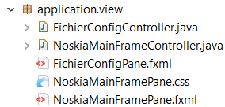

Description des classes : ::
*FichierConfigPane.fxml* le fichier de la vue de la page de paramétrage du fichier de configuration de l'application python et *FichierConfigController.java* le contrôleur de cette vue. + 
*NoskiaMainFramePane* le fichier de la vue de la page principale de l'application, *NoskiaMainFramePane.css* le fichier qui permet de styliser la vue et *NoskiaMainFrameController* le contrôler de la vue.

``PARTIE Model (en vert) : `` ::
La dernière partie du projet sera la partie Model. Cette dernière contiendra l'application python ainsi que les différent fichier nécessaire à son bon fonctionnement. +
Elle contiendra aussi la classe qui permettra d'intéragir avec l'application python et ses différents composants, pour par exemple récupérer les données du fichier de configuration (.ini) +

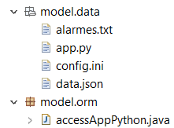

Desription des classes : ::
``Package model.data : `` contient les différents fichiers en lien avec l'application python : *app.py* l'appplication python, *config.ini* le fichier de configuration de l'application python, *data.json* le fichier de données qui sera incrémenté par l'application python et *alarmes.txt* le fichier qui contiendra toute les alarmes +
``Package model.orm : ``permettra d'intéragir avec l'application pyton : *accesAppPython.java* permettra d'utiliser l'application python.

``PARTIE tools : `` ::
La partie *tools* contiendra les divers outils nécessaire à la gestion de l'affichage des pages. Cette partie n'est pas une partie d'une MVC mais sera quand même utilie pour l'application. +

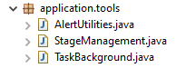
Desription des classes : ::
* la classe *AlertUtilities.java* permettra d'afficher des pop-up d'information ou de confirmation.
* la classe *StageManagement.java* permettra de gérer les interactions en page appelante et appelée.
* la classe *TaskBackground.java* permettra de gérer l'utilisation de timer et de thread. Cette classe permettra d'actualiser l'affichage des données sur les graphes.

=== Structure récurrente de code

Voici la politique de développement que respecte notre application.

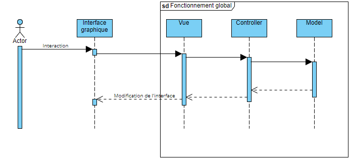

La partie _vue_ de l'application ne pourra pas avoir accès à la partie model de l'application. Si la vue à besoin d'information venant du _package model_, il faut qu'il passe par la partie _controller_. Cette dernière va se charger de faire communiquer la partie _vue_ et _model_

``Thread : ``  ::
Nous utilisons le thread de la GUI JavaFX "JavaFX Application Thread" car c'est le seul thread qui est capable de modifier l'interface graphique Javafx.

== Installation

=== Pour le développement

Tout d'abord, pour configurer l'espace de travail pour le projet d'application, voici les étapes qu'il faudra respecter. 

Logiciel : ::
* Il vous faudra les logiciels Eclipse et Scenebuilder.

Compilation : ::
* Avoir un jdk 8 qui inclu javaFX

Étapes : ::
* Ouvrir Eclipse
* Récupérer le workspace https://drive.google.com/uc?export=download&id=1r2DypQ5uPjtQMUBPGJxEuz5cvBh7aJPf[ici] (ce lien va télécharger automatiquement le workspace)
* Installer Javafx : + 
Help > Eclipse Marketplace > rechercher "fx" et télécharger JavaFX + 
A l'installation, l'IDE Eclipse devrait redémarrer
* Configuration  du JDK : + 
Window > Préférences > Java > Installed JREs > +
"Remove" du jre inclus dans Eclipse puis "Add" > Standard VM > JRE home [Directory...] => pointer sur le répertoire jdk1.8.xx.xx puis "Apply and close"
* Configuration de l'encodage : +
Window -> Préférences : > General > Workspace +
Text file encoding + 
[o] Other : UTF-8 (choisir dans le menu déroulant) +
"Apply and Close" +

Une fois cela fais, tout est OK pour continuer à développper l'application.

=== Pour l'utilisateur

Voici les étapes à suivres pour installer l'application : :: 
* Récupérer le zip de l'application https://drive.google.com/uc?export=download&id=1HyH-ABix96FT7KfhZT-D73LDH3c6fnZn[ici] (ce lien va télécharger automatiquement le fichier zip) +
* De-zipper le contenu du fichier zip télécharger en veillant à garder les fichiers dans un même dossier puis double-cliquer sur le fichier jar. +
* Si rien ne ce passe, lance un cmd à l'emplacement du dossier, puis taper la commande ``java -jar NOSKIA_APP.jar``. +

== Explication des fonctionnalités

=== Gestion de l'affichage

Voici le diagramme de séquence qui explique comment fonctionne l'affichage des différents éléments de la page principale. +
Sur le diagramme on peut apercevoir en bleu la partie gestion de la barre de menus et en rouge la partie gestion du contenu de la page.

Nous allons revenir sur chacune des deux parties plus en détails dans les sous-catégories suivantes.

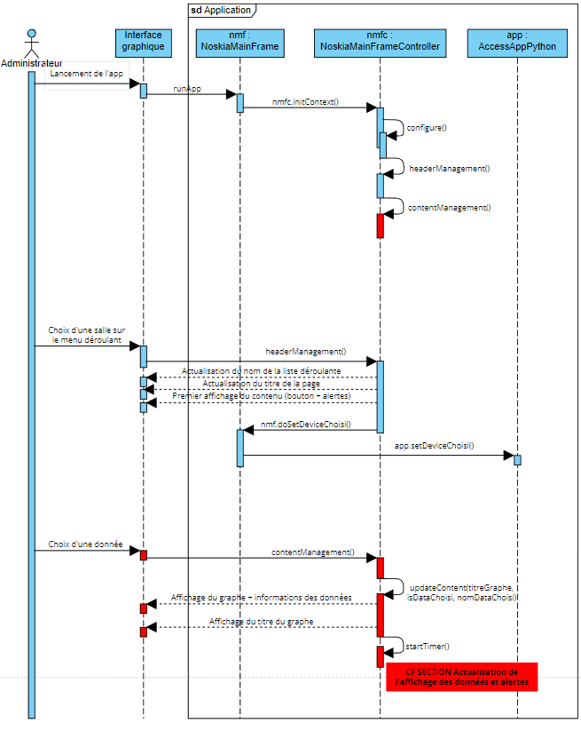

==== Choix de la salle 
Voici le diagramme de séquence de la gestion des choix des salles via la partie menu.

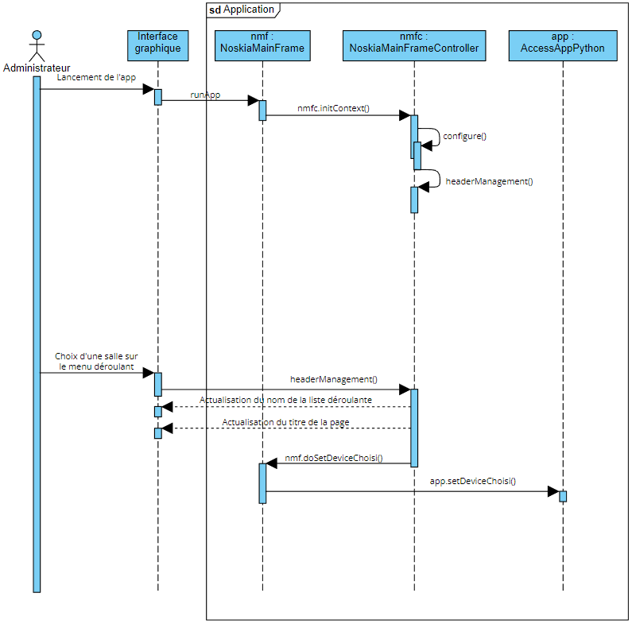

Classes impliquées : ::
* Package *application.controller* : NoskiaMainFrame.java
* Package *application.view* : NoskiaMainFrameController.java
* Package *model.orm* : AccessAppPython.java

Explication : ::
Tout d'abord lorsqu'un utilisateur de l'application lancera l'app, le contrôleur de gestion de dialogue va lancer la fonction initcontext() de la classe du contrôleur de vue. Cette dernière va permettre de faire appel à la fonction configure() qui a son tour lancera la fonction header Management(). La fonction va d'abord ajouter des contrôlers de gestion d'évènement  qui s'activeront uniquement lorsqu'un interagira avec un élément de la liste déroulante. + 
Voici ce qu'il se passe lorsqu'un évènement déclencheur est réalisée (choix dans la liste déroulante) :
* On change le titre de la salle et de la liste déroulante avec le texte du menuItem sélectionner.
* On remet la variable dataChoisi à false. Et on commence à afficher le contenu de la page (bouton de données + texte alerte)
* Puis on enregistre dans la classe AccessAppPython le nom de l'appareil (device) auquel on souhaite s'abonner.

==== Choix de la donnée affiché sur le graphe de la salle 

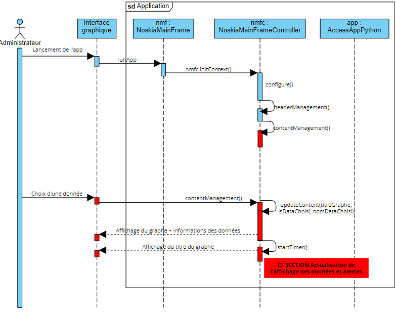

Classes impliquées : ::
* Package *application.controller* : NoskiaMainFrame.java
* Package *application.view* : NoskiaMainFrameController.java

Explication : ::
Après le lancement et après l'appel de la méthode headerManagement(), on appelle ensuite la méthode contentnManagement qui va donc se charge de gérer l'affichage des graphiques et des données. Pour cela, la méthode contentManagement() va elle aussi ajouter des contrôleurs de gestion d'évènement aux actions de clic d'un des boutons de données. +
Voici ce qu'il se passe lorsqu'un évènement déclencheur est réalisée : 
* On affiche le graphe et son titre et on retire les précédentes données de ce dernier.
* On enregistre le nom de la donnée choisie
* On lance un timer via la méthode startTimer() de la classe NoskiaMainFrameController(la section suivante explique le fonctionnement de la gestion des threads).

==== Actualisation de l'affichage des données et alertes avec thread

Voici le diagramme de séquence qui explique la fonctionnalité de gestion de l'affichage des graphiques et des alertes. L'actualisation du graphe se fera sur un thread différent du principale pour ne pas bloquer l'utilisation de ce dernier.

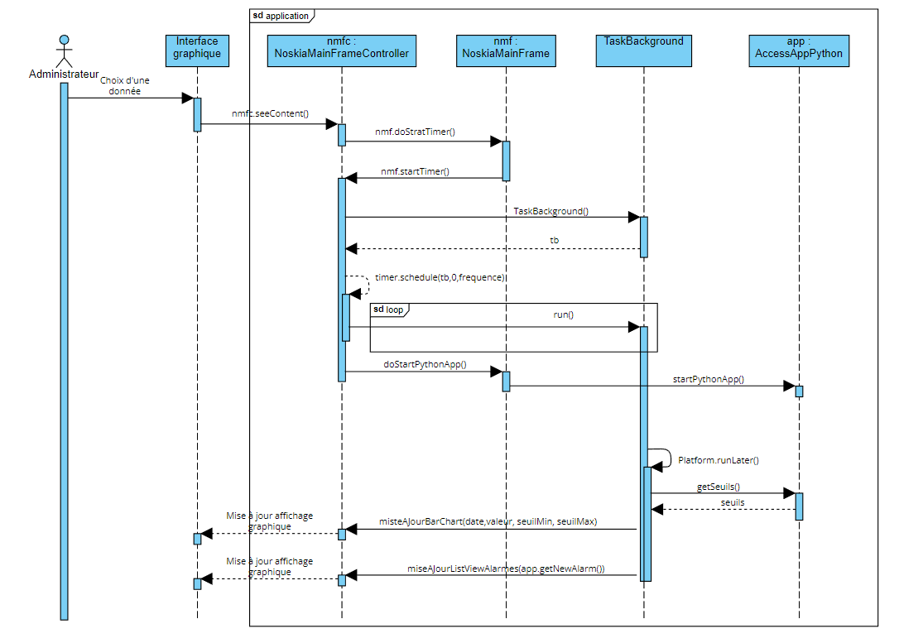

Classes impliquées : ::
* Package *application.controller* : NoskiaMainFrame.java
* Package *application.view* : NoskiaMainFrameController.java
* Package *application.tools* : Taskbackground
* Package *model.orm* : AccessAppPython.java

Explication : ::
Lorsque l'utilisateur choisit une donnée en cliquant sur un bouton de donnée, il lance la fonction seeContent() qui va, si une donnée est choisie, lancée la fonction startTimer(). Cette fonction se charge de la gestion des timer/taskbackground/application python. Elle va se charger de lancer l'application et générer des threads quand il le faut. + 
Pour cela, elle va donc d'abord créer un objet TaskBackground puis lancer un timer (qu'est une boucle infinie) sur cette tâche. Ce timer va donc boucler à l'infini la méthode run() de la classe Task Background. La méthode run() va d'abord récupérer les seuils, puis va, sur le thread de le GUI JavaFX, mettre à jour le diagramme bâton via la méthode miseajourbarchart() et le liste des alertes via la méthode miseajourlistviewalarmes().

=== Configuration du fichier .ini

Voici le diagramme de séquence de la fonctionnalité de configuration du fichier .ini.

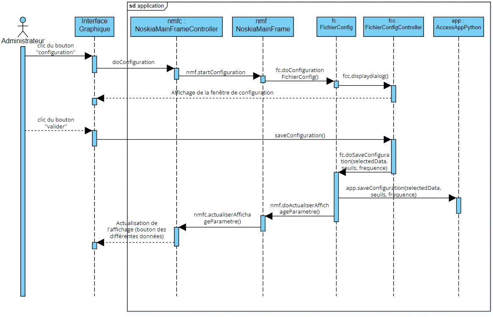

Classes impliquées : ::
* Package *application.controller* : NoskiaMainFrame.java et FichierConfig.java
* Package *application.view* : NoskiaMainFrameController.java et FichierConfigController.java
* Package *model.orm* : AccessAppPython.java

Explication : ::
Tout d'abord, à l'ouverture de la page de configuration, on commence par recharger le contexte précédent pour que les champs soient préremplis avec les valeurs précédentes. +
Une fois cela fait, lorsque l'on clique sur le bouton "valider", on lance la méthode saveConfiguration() de la classe FichierConfigController qui va faire appel à la méthode doSaveConfiguration() du contrôleur de dialogue FichierConfig qui va aller appeler la méthode saveConfiguration() de la classe AccessPython. Cette méthode va enregistrer dans le fichier .ini le paramétrage. Une fois cela fais, on actualise l'affichage de la page d'acceuil.

