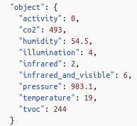

= Documentation des tests python
:icons: font
:models: models
:experimental:
:incremental:
:numbered:
:toc: macro
:window: _blank
:correction!:

toc::[]

== Explication

=== Objectif

Le but de ce programme de test est de générer fictivement des données et de les envoyer dans le fichier _data_ et de vérifier que les données écrites et générées sont bien les mêmes.

Les données générées seront donc une simulation d'une données réellement reçu.

Le but des tests est donc de vérifier que l'on écrit correctement une donnée dans le fichier de données _data_.

=== Réalisation

Le programme de test va généré des données sous la même forme que la partie  ``object`` de l'objet _MQTT_ qu'est la suivante : +

Nous rajoutons aussi la date en fin d'objet pour vérifier les cohérences.

== Comment lancer les tests

=== Installation

====  Version de Python

Aucune version spéciale de python n'est nécessaire pour lancer les tests mais nous recommandons d'installer les versions de python les plus 

Pour cela, faire la commande ``python --version``. +
Si s'affiche un message d'erreur, c'est que python n'est pas installé ou si s'affiche une version de python antérieur à la version 3.2, faire la commande ``sudo apt-get install python3._X_`` avec X pour le numéro de version voulu.

====  Récupération des test

Récupérer le fichier de test xref:../../Tests/Python/test.py[ici] et les télécharger.

Pour lancer le programme, lancer la commande ``python test.py``.

== Résultats

=== Test réussi

Si les tests passe, le code renvoie le message "Test réussi."

image::./images/testreussi.png[Images d'un test réussi]

=== Test raté

Si les tests ne passe, voici ce que l'on recoit : 

On a ::
- en rose : ``AssertionError`` est le message d'erreur.
- en bleu : ``expected`` est la donnée qu'on espérer retrouvé dans le fichier.
- en rouge : ``was`` est la donnée que l'on a retrouvé dans le fichier.