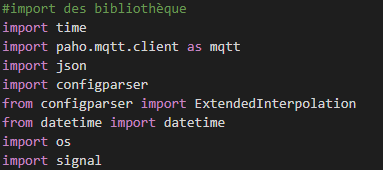
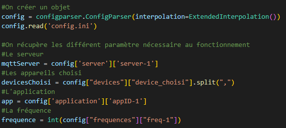
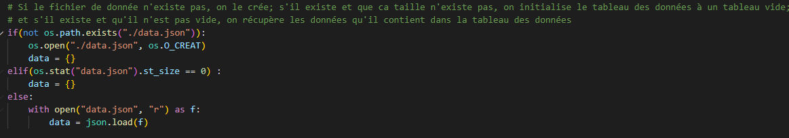
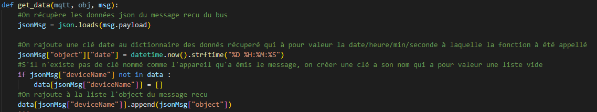
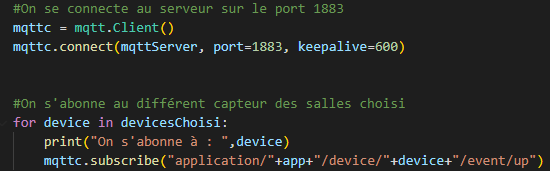
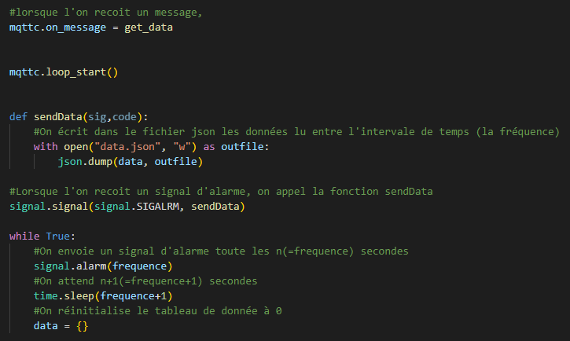

= Documentation d'installation et d'explication de l'application Python

=== Sommaire
<<id,Installation>> +
<<id,Explication>> +

[[id,Installation]]
== I. Installation

===   a. Prérequis

Pour pouvoir lancer l'application est utilisé les bibliothéque nécessaire au fonctionneùent de cette dernière, il faut la lancer sur une machine Ubuntu.

===   b. Installation

Installer la bibliothèque paho mqtt :
``pip install paho-mqtt``

[[id,Explication]]
== II. Explication

===   a. Bibliothèques utilisées

===   b. Lecture du fichier de configuration

===   c. Le fichier de données

===   d. Récupération des données

===   e. Abonnement

===   f. Fréquence et écriture

