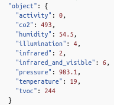

// Useful definitions
:asciidoc: http://www.methods.co.nz/asciidoc[AsciiDoc]
:icongit: icon:git[]
:git: http://git-scm.com/[{icongit}]
:plantuml: https://plantuml.com/fr/[plantUML]
:vscode: https://code.visualstudio.com/[VS Code]

ifndef::env-github[:icons: font]
// Specific to GitHub
ifdef::env-github[]
:correction:
:!toc-title:
:caution-caption: :fire:
:important-caption: :exclamation:
:note-caption: :paperclip:
:tip-caption: :bulb:
:warning-caption: :warning:
:icongit: Git
endif::[]

== I. Utilisation

=== 1) Les données

==== a. Explication
 
Nous recevons des données toute les 10 min sur un bus. Voici la partie du bus que nous garond et utilisons
 

==== b. Seuil critique

|=============
|*Nom de la donnée*|*Seuil critique*|*justification*
|Activité ou _activity_ |80|Au dessus de 80 d'activité, on considère qu'il y a une personne dans l'entrepôt
|co2|1000|Au dessus de 1000 ppm, on considère que la concentration d'air n'est plus de bonne qualité car il n'est pas renouvellement assez fréquemment.
|temperature| <15 ou >30 |On veut que la température soit comprise entre 15 et 30 degrès pour qu'un employé puisse convenablemment allez dans les entrep
|humidité ou _humididty_|<40 ou >70| On veut que l'humidité soit entre 40% et 70%, sinon il risquerait d'y avoir de la condensation / secheresse qui risquerait d'abimer les produits
|=============

=== 2) Explication du code
