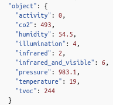
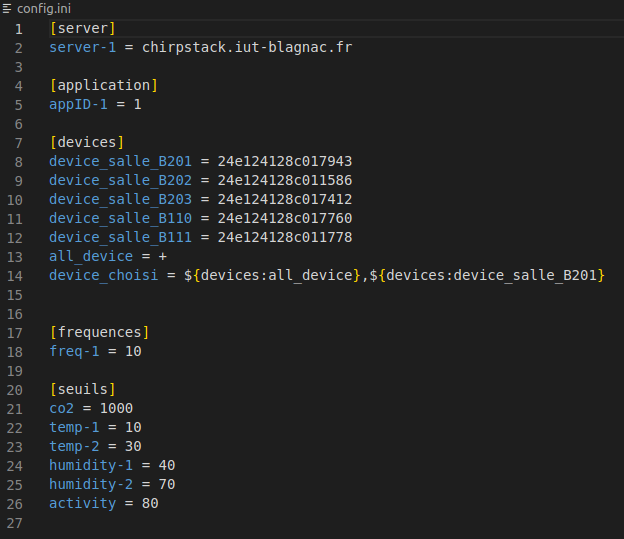

= Documentation Utilisateur Python
:icons: font
:models: models
:experimental:
:incremental:
:numbered:
:toc: macro
:window: _blank
:correction!:

toc::[]

== Les données

=== Explication
 
Nous recevons des données toute les 10 min sur un bus. Voici la partie du bus que nous garond et utilisons
 

=== Seuil critique

|=============
|*Nom de la donnée*|*Seuil critique*|*justification*
|Activité ou _activity_ |80|Au dessus de 80 d'activité, on considère qu'il y a une personne dans l'entrepôt
|co2|1000|Au dessus de 1000 ppm, on considère que la concentration d'air n'est plus de bonne qualité car il n'est pas renouvellement assez fréquemment.
|temperature| <15 ou >30 |On veut que la température soit comprise entre 15 et 30 degrès pour qu'un employé puisse convenablemment allez dans les entrep
|humidité ou _humididty_|<40 ou >70| On veut que l'humidité soit entre 40% et 70%, sinon il risquerait d'y avoir de la condensation / secheresse qui risquerait d'abimer les produits
|=============

== Fonctionnement

=== Fichier de configuration

Partie ``server`` : +
* Ce champ contient les différents serveur que l'application recouvre. Pour l'instant, il n'y en a qu'un.
* Ce champ du fichier de configuration sera utile pour une éventuelle amélioration de l'application et si elle a besoin d'un jour couvrir plusieurs serveurs.

Partie ``application`` : +
* Ici les différente application du serveur. 
* Ce champ sera aussi plus utile dans le futur, si l'application à besoin de couvrir plusieurs applications différentes.

