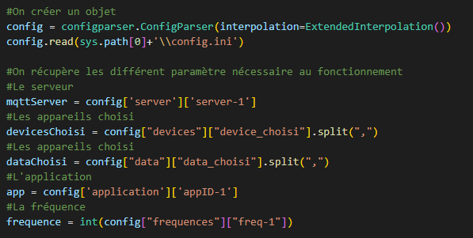
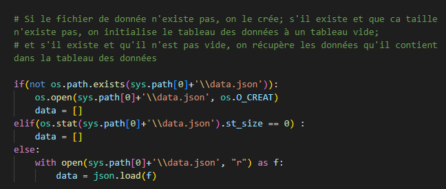
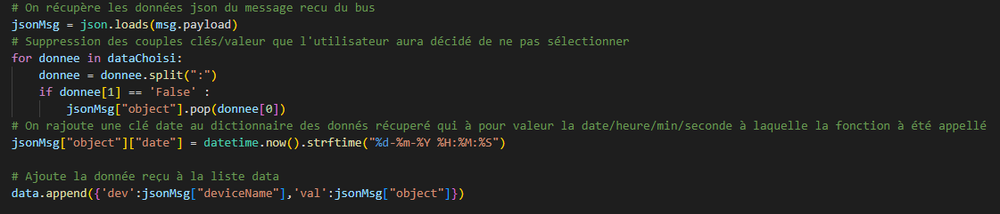
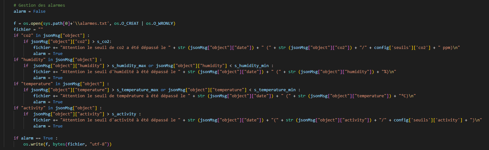

= Documentation Utilisateur Python
:icons: font
:models: models
:experimental:
:incremental:
:numbered:
:toc: macro
:window: _blank
:correction!:

toc::[]

== Les données

=== Explication
 
Nous recevons des données toute les 10 min sur un bus. Voici la partie du bus que nous garond et utilisons
 
image::./images/objet.png[Images d'un objet MQTT]

=== Seuil critique

|=============
|*Nom de la donnée*|*Seuil critique*|*justification*
|Activité ou _activity_ |80|Au dessus de 80 d'activité, on considère qu'il y a une personne dans l'entrepôt
|co2|1000|Au dessus de 1000 ppm, on considère que la concentration d'air n'est plus de bonne qualité car il n'est pas renouvellement assez fréquemment.
|temperature| <15 ou >30 |On veut que la température soit comprise entre 15 et 30 degrès pour qu'un employé puisse convenablemment allez dans les entrep
|humidité ou _humididty_|<40 ou >70| On veut que l'humidité soit entre 40% et 70%, sinon il risquerait d'y avoir de la condensation / secheresse qui risquerait d'abimer les produits
|=============

== Fonctionnement

=== Fichier de configuration

image::./images/config.png[Images des paramètres de configuration]

Partie ``server`` ::
- Ce champ contient les différents serveur que l'application recouvre. Pour l'instant, il n'y en a qu'un.
- Ce champ du fichier de configuration sera utile pour une éventuelle amélioration de l'application et si elle a besoin d'un jour couvrir plusieurs serveurs.

Partie ``application`` ::
- Ici les différente application du serveur. 
- Ce champ sera aussi plus utile dans le futur, si l'application à besoin de couvrir plusieurs applications différentes.

Partie ``devices`` ::
- Nous avons ici les différents appareils que couvre nos capteurs. La clef représente la nom de la salle dans laquel le capteur est et en valeur représente la valeur concrete du capteur sur le serveur.
- Le champs _device_choisi_ sera la liste des devices choisis d'être suivi par un administrateur (utilisateur de l'application Java)

Partie ``frequences`` ::
- Ici sera stocké la fréquence (en seconde) à laquelle l'utilisateur recevra des données. Il recevrea tout les messages reçu dura l'intervalle de temps car nous avons choisi de ne pas perdre de la donnée. L'heure indiqué sur le message reçu pendant un intervalle de temps sera la valeur réelle à laquelle l'application à reçu le message et non le moment ou l'utilisateur recevra les informations. +
Ces choix ont été réalisé car nous ne voulions pas perdre la véracité de l'information, ici nous gardons tous les messages et leur horaires réelles.

Partie ``seuils`` ::
- Nous avons ici les différents seuil critique, qui, lorsqu'un sera dépassé, déclenchera l'envoie d'une alarme dans un fichier texte.

Partie ``data`` ::
- Ici sera indiquer si nous devons récupérer une donnée ou non. Si c'est le cas, elle sera à True et sinon elle sera à False.
- En dernier, nous avons un champ qui contient tous les noms de données avec pour information True ou False. Ce champ sera parcouru dans une boucle pour éviter de faire trop de _if_ imbriqué.

=== le code de l'application

==== Lecture du fichier de configuration

- On commence par créer un objet _config_ qui va lire le fichier ``config.ini``
- On récupère chaque champs qui nous intéresse (serveur, appareil choisi, application et fréquences)

==== Création du fichier de donnée

Cette partie de code permmetra de soit créer un fichier de donnée vide s'il n'existe pas. S'il existe mais qu'il est vide, ne pas récupérer de donnée. Et s'il existe et contient des/une donnée, récupérer ces données pour ne pas les perdre.

On initialise ici la varaible *_data_* en fonction des différents cas.

==== Action lorsque l'on recoit un message

``Partie 1 : Récupération de la données``

Dans cette première partie de la fonction _get_data()_, nous commencons par récupérer entièremment le message que nous stockons dans la variable *_data_*. Cette variable est très importante car elle contient toute les données qui seront envoyé plus tard (cf. section "Fréquence et écriture"). 

La variable *_data_* est donc un tableau associatif qui associe en clé une chaine de caractère (qui représente le nom de l'appareil dont vient le message) et qui a pour valeur une liste, qui contient chaque message de données. Pour les différencier, nous avons rajouté à chaque message la date et l'heure à laquelle le message a été reçu.

``Partie 2 : Gestion des dépassement de seuil``

- Pour gérer les seuils, nous commencons par créer un fichier alarme.txt s'il n'existe pas.
- Ensuite, nous testons si chaque seuil est depassé. Si c'est le cas, nous écrivons un message adéquat au dépassement dans le fichier.

``Partie 3 : Gestion du choix des données gardées``

- Pour le choix des données, nous avons donc en ``partie 1`` récupérer toute les données du message. 
- Ici, nous testons donc si les données du fichier de configuration sont en 'False'. Si c'est le cas, on retire l'information du message (car nous l'avons pas encore envoyé dans le fichier de donnée)

==== Abonnement

Ici, on se connecte au serveur sur le bon port. Puis on s'abonne aux différents topics que l'utilisateur aura sélectionné, c'est-à-dire aux différents capteurs sélectionnés.

==== Fréquence et écriture dans le fichier de donnée

image::./images/ecriture.png[Image écriture et gestion des fréquences]

Pour gérer les fréquences, nous avons décider d'envoyer une alarme chaque _n secondes_ (n = fréquence en seconde). Cette alarme déclenchera une fonction qui enverra les données sur le fichier de donnée.

- On commence donc pas substituer l'usage normal du signal alarme pour le remplacer par la fonction _sendData_ qui permet d'écrire dans le fichier de configuration
- On commence ensuite une boucle infine qui envoie une alarme, attend _n secondes_ (n = fréquence en seconde) et attend ensuite pour en renvoyer une autre.

=== Structure du fichier de donnée
