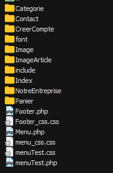
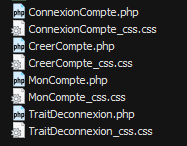
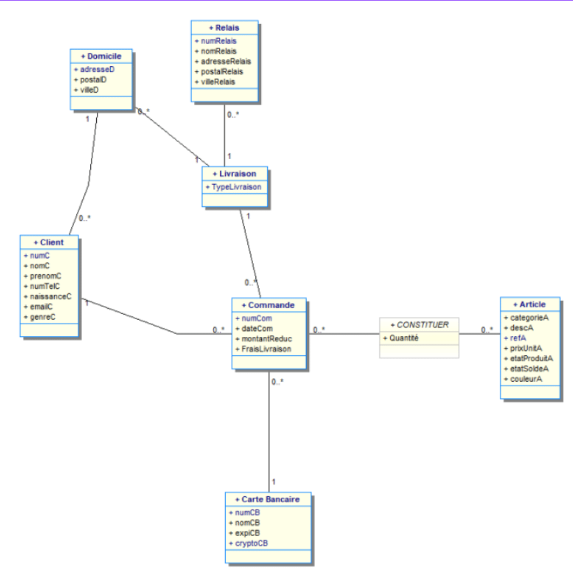

= Documentation Technique Web
:icons: font
:models: models
:experimental:
:incremental:
:numbered:
:toc: macro
:window: _blank
:correction!:

toc::[]

== Description du projet

=== Equipe

L'équipe était composé de 5 membres et voici les rôles que chaque personne occupés : ::
* Mathis : Product Owner
* Quentin : Developper
* Jordan : Developper
* Adriel : Developper
* Antoine : Scrum Master

=== Contexte du projet

Noskia, créée en 1995, par Volodymyr Tapenade et Igor Consultation en Finlande, vend du matériel de sports d’hiver. Son chiffre d’affaire était de 700 000 € annuel en 2021. Volodymyr et son meilleur ami Igor, passionnés tous deux de bobsleigh depuis qu’ils ont regardés le film ‘Rasta Rockett’ sur leurs télés cathodiques, se trouvent dans l’incapacité d’en pratiquer. En effet, ils habitent dans un endroit reculé du pays. Déterminés à pratiquer ce sport, ils quittent tout. Femmes, enfants et chien, afin de se consacrer pleinement à leur nouveau projet de vie : fonder une entreprise vendant du matériel de sport d’hiver dans leur ville natale, Helsinski, afin de partager leur passion avec le plus grand nombre. L’entreprise comprend 2 directeurs et une vingtaine de salariés

=== Objectifs du projet

``Problématique :``
Avec la digitalisation des entreprises ces dernières années, Noskia a besoin d’un vent de fraîcheur pour relancer son chiffre d’affaires. En effet, l’entreprise se trouve dans un endroit peu urbanisé de la Finlande, et a besoin de toucher de nouveaux clients. Elle voudrait gagner en part de marché, et surtout de faire face à la concurrence qui s’intensifie. La très faible communication entre l’entrepriseet ses clients est également problématique. Nos produits s’adressent principalement à des personnes amateurs, avec une gamme de prix abordable sans pour autant négliger la qualité de nos produits.

``Objectif :`` Le but de ce projet est donc de relancer les ventes de Noskia tout en permettant à cette dernière de s'étendre dans tout l'Europe. Le projet permettra à Noskia de récupérer les parts de marché qu'elle a perdu en rattrapant son retard digital. 

== Architecture du projet 

=== Architecture générale

Le projet sera donc un site web de e-commerce en lien avec une base de donnée : ::

Le site web sera codé en HTML/CSS/JAVASCRIPT/PHP et sera héberger sur un serveur apache prété par l'IUT. +
La base de donnée sera une base de donnée Orcale en SQL.

=== Organisation du site web

Voici l'arborescence du site web.

On remarque en bas les fichiers les plus important qui sera inclue dans chaque page. On retrouve l'_header_ et le _footer_ qui sont respectivement le menu et le bas de page du site web.

Chaque dossier contient une partie du site web. Par exemple la partie _CreerCompte_ contient qui seront en rappart avec la gestion de compte (créer un compte, se connecter, espace membre, déconnexion) qui sont les suivants : 

Description de chaque sous-dossier ::
``Categorie`` : +
``Contact`` : +
``CreerCompte`` : les fichiers qui géreront la création de compte, la connexion, l'espace membre (historique des commandes, modifier les informations) et la deconnexion. +
``font`` : +
``Image`` : +
``include`` : +
``Index`` : +
``NotreEntreprise`` : +
``Panier`` : les fichiers qui géreront le panier et le traitement de ce dernier +

=== Organisation de la base de donnée

Schéma du digramme de classe : 

== Fonctionnalités