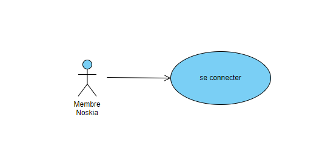

= Documentation Technique Web
:icons: font
:models: models
:experimental:
:incremental:
:numbered:
:toc: macro
:window: _blank
:correction!:

toc::[]

== Description du projet

=== Equipe

L'équipe était composé de 5 membres et voici les rôles que chaque personne occupés : ::
* *Mathis* : Product Owner
* *Quentin* : Developper
* *Jordan* : Developper
* *Adriel* : Developper
* *Antoine* : Scrum Master

=== Contexte du projet

Noskia, créée en 1995, par Volodymyr Tapenade et Igor Consultation en Finlande, vend du matériel de sports d’hiver. Son chiffre d’affaire était de 700 000 € annuel en 2021. Volodymyr et son meilleur ami Igor, passionnés tous deux de bobsleigh depuis qu’ils ont regardés le film ‘Rasta Rockett’ sur leurs télés cathodiques, se trouvent dans l’incapacité d’en pratiquer. En effet, ils habitent dans un endroit reculé du pays. Déterminés à pratiquer ce sport, ils quittent tout. Femmes, enfants et chien, afin de se consacrer pleinement à leur nouveau projet de vie : fonder une entreprise vendant du matériel de sport d’hiver dans leur ville natale, Helsinski, afin de partager leur passion avec le plus grand nombre. L’entreprise comprend 2 directeurs et une vingtaine de salariés

=== Objectifs du projet

``Problématique :``
Avec la digitalisation des entreprises ces dernières années, Noskia a besoin d’un vent de fraîcheur pour relancer son chiffre d’affaires. En effet, l’entreprise se trouve dans un endroit peu urbanisé de la Finlande, et a besoin de toucher de nouveaux clients. Elle voudrait gagner en part de marché, et surtout de faire face à la concurrence qui s’intensifie. La très faible communication entre l’entrepriseet ses clients est également problématique. Nos produits s’adressent principalement à des personnes amateurs, avec une gamme de prix abordable sans pour autant négliger la qualité de nos produits.

``Objectif :`` Le but de ce projet est donc de relancer les ventes de Noskia tout en permettant à cette dernière de s'étendre dans tout l'Europe. Le projet permettra à Noskia de récupérer les parts de marché qu'elle a perdu en rattrapant son retard digital. 

== Architecture du projet 

=== Architecture générale

Le projet sera donc un site web de e-commerce en lien avec une base de donnée : ::

Le site web sera codé en HTML/CSS/JAVASCRIPT/PHP et sera héberger sur un serveur apache prété par l'IUT. +
La base de donnée sera une base de donnée Orcale en SQL.

=== Organisation du site web

Voici l'arborescence du site web.

On remarque en bas les fichiers les plus important qui sera inclue dans chaque page. On retrouve l'_header_ et le _footer_ qui sont respectivement le menu et le bas de page du site web.

Chaque dossier contient une partie du site web. Par exemple la partie _CreerCompte_ contient qui seront en rappart avec la gestion de compte (créer un compte, se connecter, espace membre, déconnexion) qui sont les suivants : 

Description de chaque sous-dossier ::
``Categorie :`` les fichiers qui géreront l'affichage des différents articles et catégorie +
``Contact :`` les fichiers qui géreront la partie qui permet de contacter l'entreprise +
``CreerCompte :`` les fichiers qui géreront la création de compte, la connexion, l'espace membre (historique des commandes, modifier les informations) et la deconnexion. +
``font :`` les polices utilisés pour le site +
``Image :`` les images utilisés pour le site +
``include :`` +
``Index :`` +
``NotreEntreprise :`` les fichiers qui géreront la partie nouventé + présentation de l'entreprise +
``Panier :`` les fichiers qui géreront le panier et le traitement de ce dernier +

=== Organisation de la base de donnée

Schéma du digramme de classe : 

== Fonctionnalités

=== Création d'un compte

Use case de la fonctionalité : 

*Localisation des fichiers de code* ::
    ``CreerCompte.php`` => CreerCompte/CreerCompte.php +
    ``ConnexionCompte.php`` => CreerCompte/CreerCompte.php +

*Fonctionnement* ::
    Pour afficher le formulaire, le fichier ``CreerCompte.php`` va donc créer un formulaire qui comportera les différents champs requis pour créer un compte(nom, prénom, email, téléphone, genre, date de naissance, mot de passe, adresse, code postal et ville). +
    Une fois tout les champs remplies (il est nécessaire qu'il les soit), ce même fichier va traier le formulaire. Pour cela, il faut tester d'abord que le mail n'appartient pas déjà à un compte, si c'est le cas, le création de compte est refusée. Si ce n'est pas le pas, nous allons donc insérer dans la BD une nouvelle entré dans la table _Client_ et _Domicile_. + 
    Pour acceder à l'espace de création de compte, il suffit de cliquer sur le lien "creer un compte" sur la page de formulaire de connexion ``ConnexionCompte.php``.

*Accessibilité* ::
    Visiteur du site / Page connexion à mon compte (pictogramme de personnage à droite de l'header) / lien _"creer un compte"_ en bas de l'écran 

=== Connexion à son compte

Use case de la fonctionalité : 

*Localisation des fichiers de code* ::
    ``ConnexionCompte.php`` => CreerCompte/
    ``MonCompte.php`` => CreerCompte/

*Fonctionnement* ::
    Pour traiter une connexion, la page ``ConnexionCompte.php`` va d'abord afficher un formulaire. Ce dernier comporte deux champs, le champs email et le champs mot de passe. + 
    Ce même fichier traite son propre envoie. Pour cela, il va recupérer tout les comptes clients présent sur la base de données puis va récupérer l'email et le mot de passe(qui est haser, va donc le dé-haser). +
    Si le couple email/mdp rentré dans le formulaire correspond à un couple de la base de données, une session sera donc créer ou nous retiendrons le nom, prénom et numéro client du membre connecté. L'utilisateur sera ensuite redirigé vers la page ``MonCompte.php``. + 
    Si une session est ouverte et que l'on veut se connecter, on sera automatiquement redirigé vers l'espace membre (page ``MonCompte.php``).

*Accessibilité* ::
    Visiteur du site / pourra se connecté uniquement s'il a créer un compte / pictogramme de personnage à droite de l'header.

=== Espace membre 

Use case de l'espace membre du membre connecté : 

==== Deconnexion

Use case de la fonctionnalité :

*Localisation des fichiers de code* ::
    ``MonCompte.php`` => CreerCompte/ +
    ``TraitDeconnexion.php`` => CreerCompte/ +
    ``ConnexionCompte.php`` => CreerCompte/ +

*Fonctionnement* ::
    Une fois sur l'espace membre (page ``MonCompte.php``), l'utilisateur à la possibilité. Pour cela, il lui suffit de cliquer sur le pictogramme ou texte _"deconnexion"_. Cela lancera la page ``TraitDeconnexion.php`` + 
    La page ``TraitDeconnexion.php`` va terminer la session et redirige vers la page de ``ConnexionCompte.php``. 

*Accessibilité* ::
   Membre noskia connecté / page espace membre / pictogramme en haut à droite.

==== Modifier ses informations

Use case de la fonctionnalité :

*Localisation des fichiers de code* ::
    ``MonCompte.php`` => CreerCompte/ +

*Fonctionnement* ::
    Pour pouvoir modifier ses informations, il faut accéder à la page ``MonCompte.php`` puis cliquer sur l'onglet "modifier mes informations". Une fois cela fais, un formulaire apparaîtra à l'écran avec toute les informations que l'utilisateur poura modifier. Ce dernier sera près remplie avec les informations du client. +
    Ce fichier traite son propre traitement. Il va, à la pression du bouton "modifier", enregistrer dans la BD les modification et redirigé vers la page d'accueil de l'espace membre.

    
*Accessibilité* ::
   Membre noskia connecté / page espace membre (onglet _"modifier mes information"_).

