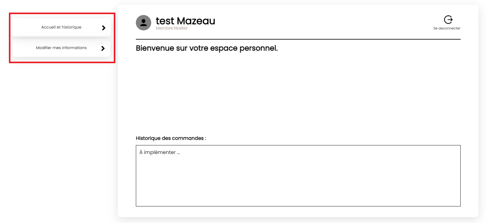
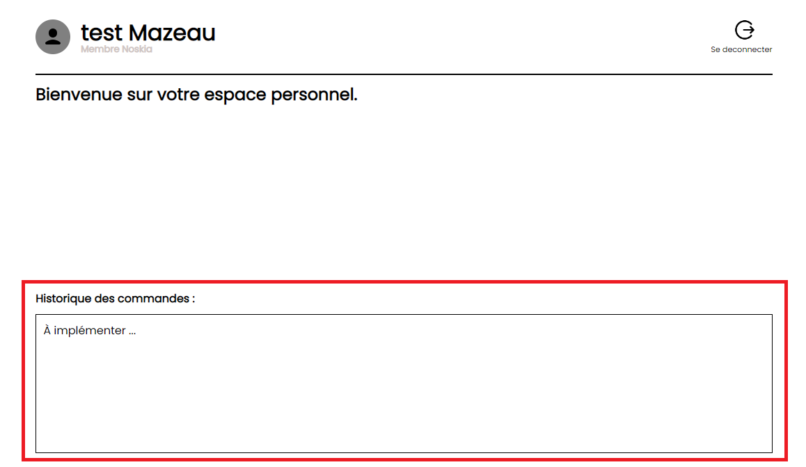

= Documentation Utilisateur Web
:icons: font
:models: models
:experimental:
:incremental:
:numbered:
:toc: macro
:window: _blank
:correction!:

toc::[]

``*Version :*`` v7.0 +
``*Client :*`` Noskia +
``*Nom du site :*`` Site de Noskia +

== Description du projet

=== Equipe

L'équipe était composé de 5 membres et voici les rôles que chaque personne occupés : ::
* Mathis : Product Owner
* Quentin : Developper
* Jordan : Developper
* Adriel : Developper
* Antoine : Scrum Master

=== Contexte du projet

Noskia, créée en 1995, par Volodymyr Tapenade et Igor Consultation en Finlande, vend du matériel de sports d’hiver. Son chiffre d’affaire était de 700 000 € annuel en 2021. Volodymyr et son meilleur ami Igor, passionnés tous deux de bobsleigh depuis qu’ils ont regardés le film ‘Rasta Rockett’ sur leurs télés cathodiques, se trouvent dans l’incapacité d’en pratiquer. En effet, ils habitent dans un endroit reculé du pays. Déterminés à pratiquer ce sport, ils quittent tout. Femmes, enfants et chien, afin de se consacrer pleinement à leur nouveau projet de vie : fonder une entreprise vendant du matériel de sport d’hiver dans leur ville natale, Helsinski, afin de partager leur passion avec le plus grand nombre. L’entreprise comprend 2 directeurs et une vingtaine de salariés

=== Objectifs du projet

``Problématique :``
Avec la digitalisation des entreprises ces dernières années, Noskia a besoin d’un vent de fraîcheur pour relancer son chiffre d’affaires. En effet, l’entreprise se trouve dans un endroit peu urbanisé de la Finlande, et a besoin de toucher de nouveaux clients. Elle voudrait gagner en part de marché, et surtout de faire face à la concurrence qui s’intensifie. La très faible communication entre l’entrepriseet ses clients est également problématique. Nos produits s’adressent principalement à des personnes amateurs, avec une gamme de prix abordable sans pour autant négliger la qualité de nos produits.

``Objectif :`` Le but de ce projet est donc de relancer les ventes de Noskia tout en permettant à cette dernière de s'étendre dans tout l'Europe. Le projet permettra à Noskia de récupérer les parts de marché qu'elle a perdu en rattrapant son retard digital. 

== Liens pour Accèder au site web 

Pour accède au site web, il suffit de cliquer sur : ::
 * ce http://192.168.224.139/~SAESYS02/SAE/Index/[lien] si vous vous situé sur le réseau de l'IUT + 
 * ce http://193.54.227.164/~SAESYS02/SAE/Index/[lien] sinon. 

== Utilisation du site

=== Explication du fonctionnement visiteur/client (ou membre)

Le site de Noskia comporte deux types d'utilisateurs : les visiteurs et les membres. + 

Un visiteur pourra uniquement consulter les articles et pourra se créer un compte. Un visiteur aura accès aux nouveautés ainsi qu'à l'histoire de Noskia pour mieux comprendre qui est l'entreprise.+

Un membre Noskia pourra lui effectuer des commandes : lorsqu'il consultera les articles, il pourra les ajouter à son panier. Et s'il est connecté il pourra passer commande sur le site. +

Les membres connectés ont différents avantages : ::
* la possibilité de laisser des avis sur les produits commandés
* avoir accès à l'historique de ses commandes
* pouvoir modifier ses informations à tout moment
* recevoir des mails en fonction de l'avancement des commandes
* et pouvoir passer des commandes

=== Explication du fonctionnement administrateur

== Fonctionnalités 

=== Création d'un compte

Pour pouvoir créer un compte, il faut cliquer sur l'icône ci-dessous que l'on peut retrouver en haut à droite de l'écran sur n'importe quel page.

Cet icône ramène vers la page d'un espace d'un membre. Mais s'il n'est pas connecté, il sera redirigé vers cette page. Il suffit de cliquer sur le lien "Creer un compte" pour être redirigé vers la page de création de compte.

Voici la page de création de compte : +

Cliquer sur le bouton "Valider" permettra de créer un compte si tout les champs sont remplis et respecte les critères de création de compte (si l'email est déjà associé à un compte => erreur, si la confirmation du mot de passe est différente du mot de passe => erreur, ...)

=== Connexion à son compte

Une fois le compte créer, pour se connecter il suffit de cliquer si le même icônes que pour créer son compte.

Cela permet d'arriver à la page de connexion si l'utilisateur n'est pas déjà connecté. Une fois cela fait, il suffit de renter son adresse mail et son mot de passe pour se connecter. Si le couple est correct, l'utilisateur sera redirigé vers son espace membre.

=== Espace membre

==== Acceuil espace membre
Voici la page que l'utilisateur trouvera lorsqu'il sera connecté sur son espace membre. Il pourra naviguer entre les différentes fonctionnalités via le menu à gauche de l'interface.

==== Deconnexion
Pour se déconnecter, il suffit de cliquer soit sur le texte "déconnexion" ou sur le logo déconnexion tout deux en haut à droite de l'interface.

==== Historique des commandes

Un membre connecté devra pouvoir voir l'historique de ses commandes. +

L'historique des commandes se situe en bas de la page d'acceuil de l'espace membre. Il n'est pour l'instant pas implémenter car n'est que basse priorité pour le client.

==== Modifier ses informations

Pour modifier ses informations, il suffit de naviguer via le menu de la page d'acceuil de l'espace membre sur l'onglet "modifier mes informations"

Une fois arrivé sur la page, voici l'interface qu'il verra. Il pourra modifier toute les informations qu'il voudra et cliquer sur le bouton "modifier" en bas de l'interface pour enregistrer ses modifications. 

